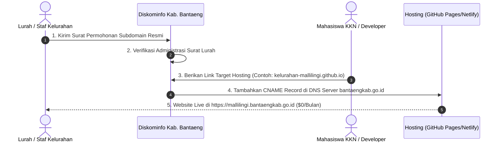

# Panduan Mekanisme Pengajuan Subdomain Resmi (`mallilingi.bantaengkab.go.id`) ke Diskominfo Kabupaten Bantaeng

## 📌 Latar Belakang
Setiap Kelurahan di Indonesia berada di bawah naungan Pemerintah Kabupaten/Kota secara resmi. Oleh karena itu, Pemerintah Kabupaten Bantaeng melalui **Dinas Komunikasi dan Informatika (Diskominfo) Kabupaten Bantaeng** memiliki wewenang untuk menerbitkan subdomain resmi `.go.id` secara **100% GRATIS (Tanpa Biaya)** bagi Kelurahan Mallilingi.

Dokumen ini berisi panduan mekanisme administratif, teknis penambatan (*pointing DNS*), serta **Template Surat Permohonan Resmi Lurah**.

---

## 🛠️ Alur & Mekanisme Pengajuan (4 Langkah Mudah)



---

### Langkah 1: Pembuatan Surat Permohonan Resmi Kelurahan
Lurah Mallilingi menerbitkan Surat Permohonan Pengajuan Subdomain yang ditujukan kepada **Kepala Dinas Komunikasi dan Informatika Kabupaten Bantaeng**.

---

### Langkah 2: Penyerahan Surat ke Kantor Diskominfo Kabupaten Bantaeng
Staf Kelurahan atau Mahasiswa KKN menyerahkan surat permohonan ke Kantor Diskominfo Kabupaten Bantaeng (bagian Pengelolaan Layanan Informasi & E-Government).

---

### Langkah 3: Konfigurasi Teknis *DNS Pointing* (Oleh Tim IT Diskominfo & KKN)
Setelah surat disetujui, Mahasiswa KKN / Staf Kelurahan memberikan **Target URL Hosting Gratis** (hasil publikasi dari GitHub Pages / Netlify / Vercel):
- **Target URL Hosting**: `kelurahan-mallilingi.github.io` (atau `mallilingi-bantaeng.netlify.app`).

Tim IT Diskominfo akan menambahkan entri DNS pada server `bantaengkab.go.id`:
- **Record Type**: `CNAME`
- **Host / Subdomain**: `mallilingi`
- **Target Value**: `kelurahan-mallilingi.github.io` (atau domain Netlify)

---

### Langkah 4: Website Resmi Berdomain `.go.id` Siap Akses 24/7
Dalam waktu 1x24 jam (proses propagasi DNS), website Kelurahan Mallilingi secara otomatis dapat diakses publik di seluruh dunia melalui alamat resmi:
👉 **`https://mallilingi.bantaengkab.go.id`**

---

## 📄 Template Surat Permohonan Resmi Lurah (Siap Cetak)

```text
PEMERINTAH KABUPATEN BANTAENG
KECAMATAN BANTAENG
KELURAHAN MALLILINGI
Alamat: Jl. Sungai Calendu, Kel. Mallilingi, Kec. Bantaeng, Kode Pos 92411

Nomor   : 050 / ...... / K-ML / VIII / 2026                 Mallilingi, ... August 2026
Lampiran: 1 (satu) Berkas Proposal Web
Perihal : Permohonan Pengajuan Subdomain Resmi .go.id

Kepada Yth.
Kepala Dinas Komunikasi dan Informatika Kabupaten Bantaeng
di -
    Tempat

Dengan hormat,

Dalam rangka meningkatkan transparansi publik, efisiensi pelayanan administrasi kependudukan, serta publikasi potensi wilayah di Kelurahan Mallilingi, Pemerintah Kelurahan Mallilingi bekerja sama dengan Mahasiswa KKN telah membangun Platform Web Portal Informasi & Pengelolaan Media Kelurahan Mallilingi.

Sehubungan dengan hal tersebut, kami mengajukan permohonan penerbitan dan pembuatan subdomain resmi Pemerintah Kabupaten Bantaeng untuk platform web dimaksud dengan rincian sebagai berikut:

Usulan Nama Subdomain : mallilingi.bantaengkab.go.id
Peruntukan           : Portal Resmi & Pelayanan Publik Kelurahan Mallilingi
Target Server Hosting : kelurahan-mallilingi.github.io (GitHub Pages / Netlify)

Demikian permohonan ini kami sampaikan. Atas perhatian, bantuan, dan kerja sama Bapak, kami ucapkan terima kasih.


                                            Lurah Mallilingi,


                                            H. ANDI SYAMSUL, S.Sos., M.Si.
                                            NIP. 19780512 200501 1 004
```

---

## 💡 Keuntungan Bagi Kelurahan Mallilingi
1. **100% Gratis Selamanya ($0)**: Tidak ada biaya pendaftaran domain maupun perpanjangan tahunan.
2. **Kredibilitas Pemerintah (Domain `.go.id`)**: Meningkatkan kepercayaan warga dan instansi luar karena menggunakan domain resmi Pemerintah Republik Indonesia.
3. **Terintegrasi dengan Pemkab Bantaeng**: Website kelurahan menjadi bagian dari ekosistem digital resmi Kabupaten Bantaeng.
