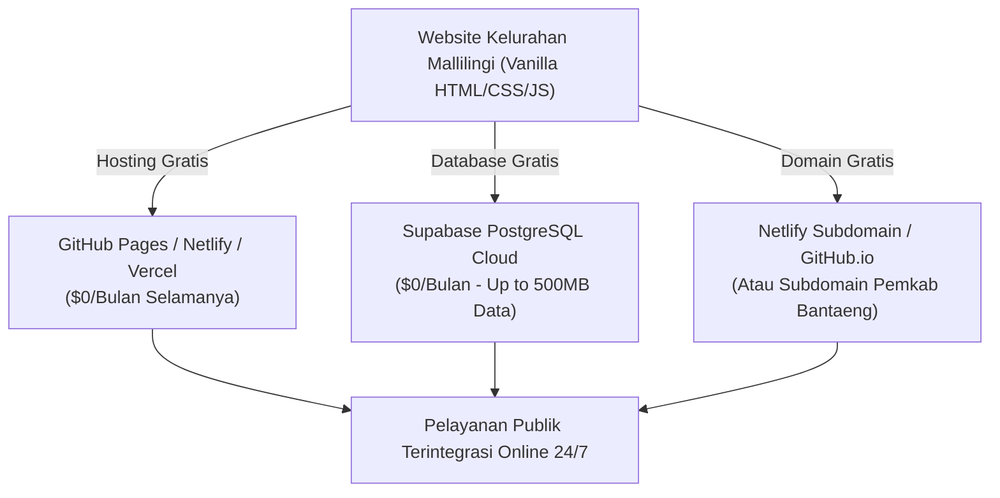

# Rencana Integrasi 100% Gratis ($0 Selamanya) - Website Kelurahan Mallilingi

## 📌 Deskripsi Tujuan
Mengingat proyek KKN ini berjalan **tanpa dana insentif / Rp 0 (Zero Budget)**, dokumen ini menyajikan rencana arsitektur teknis **100% GRATIS SELAMANYA** tanpa biaya langganan bulanan maupun tahunan.

Solusi ini menggunakan teknologi *Modern Cloud Stack Free Tier* yang tepercaya, berkecepatan tinggi, dan bergaransi *uptime* 99.9%.

---

## 🚀 1. Rekomendasi Kombinasi Teknologi 100% Gratis ($0 Stack)



### A. Hosting Website: GitHub Pages / Netlify / Vercel ($0 Selamanya)
- **Biaya**: **Rp 0 / Gratis Selamanya**.
- **Kelebihan**:
  - **SSL/HTTPS Gratis (Ikon Gembok Hijau Aman)**.
  - Server sangat cepat (CDN Global) & tidak pernah mati/tidur.
  - Sangat mudah dipublikasikan (cukup upload folder proyek ke GitHub / Netlify / Vercel).

### B. Database Online: Supabase Free Tier ($0 Selamanya)
- **Biaya**: **Rp 0 / Gratis Selamanya** (Kapasitas hingga 500MB data & 50.000 pengguna per bulan, sangat melimpah untuk skala Kelurahan).
- **Kelebihan**:
  - **Realtime Data Sync**: Ketika Staf Kelurahan mengubah Berita/UMKM/Layanan di `admin.html`, seluruh warga yang membuka website langsung melihat data terbaru.
  - **Tabel Manajemen Visual**: Memiliki dashboard visual yang mudah digunakan oleh staf.
  - **Tanpa Server Backend (Serverless)**: Cukup dipasang lewat CDN JavaScript di `js/data.js`.

### C. Nama Domain ($0 Selamanya)
1. **Opsi Subdomain Gratis**:  
   - `kelurahan-mallilingi.github.io`
   - `mallilingi-bantaeng.netlify.app`
2. **Opsi Resmi Pemkab (Rekomendasi Tambahan Proker KKN)**:  
   - Pengajuan gratis subdomain kabupaten seperti `mallilingi.bantaengkab.go.id` ke Diskominfo Kabupaten Bantaeng oleh pihak Kelurahan.

---

## 🛠️ 2. Langkah-Langkah Integrasi Database Supabase ($0)

Apabila disetujui, berikut adalah langkah teknis integrasi yang akan kita lakukan pada kode proyek:

### Langkah 1: Pemasangan SDK Supabase di `index.html` & `admin.html`
Menambahkan script CDN resmi Supabase:
```html
<script src="https://cdn.jsdelivr.net/npm/@supabase/supabase-js@2"></script>
```

### Langkah 2: Pembaruan `js/data.js` (Dual-Mode: Supabase + Fallback LocalStorage)
```javascript
// Konfigurasi Supabase (Free Tier)
const SUPABASE_URL = "https://your-project.supabase.co";
const SUPABASE_KEY = "your-anon-key";
const supabase = window.supabase.createClient(SUPABASE_URL, SUPABASE_KEY);

// Ambil Data dari Database Supabase (Fallback ke LocalStorage jika offline)
async function getMallilingiData() {
  try {
    const { data: berita } = await supabase.from('berita').select('*');
    const { data: umkm } = await supabase.from('umkm').select('*');
    const { data: layanan } = await supabase.from('layanan').select('*');
    
    if (berita && umkm && layanan) {
      return { ...DEFAULT_MALLILINGI_DATA, berita, umkm, layanan };
    }
  } catch (e) {
    console.warn("Offline / Gagal koneksi Supabase, menggunakan LocalStorage fallback:", e);
  }
  return getMallilingiDataFromLocalStorage();
}
```

---

## Verification Plan

### Manual Verification
1. Uji input data berita/UMKM di `admin.html`.
2. Buka `index.html` di perangkat lain (atau browser berbeda) untuk memastikan data baru otomatis muncul tanpa perlu impor file JSON manual.
3. Pastikan website dapat dibuka di HP/PC via link domain gratis.
