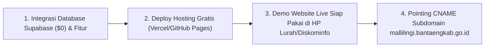

# Rencana Tahapan Eksekusi: Penyelesaian Website Sebelum Pengajuan ke Pemkab Bantaeng

## 📌 Kesimpulan & Rekomendasi Alur
> [!IMPORTANT]
> **Jawaban**: **SANGAT BOLEH DAN SANGAT DIREKOMENDASIKAN!**
> 
> Menyelesaikan seluruh website, mengintegrasikan database Supabase Cloud, dan mempublikasikannya ke hosting gratis (Vercel/GitHub Pages/Netlify) terlebih dahulu **adalah langkah terbaik** sebelum mengajukan permohonan ke Diskominfo Pemkab Bantaeng.

---

## 🎯 4 Alasan Mengapa Harus Diselesaikan Dulu:

1. **Syarat Teknis Diskominfo**: Tim IT Diskominfo membutuhkan **URL Target Hosting yang sudah berjalan (*live*)** untuk ditautkan (*CNAME DNS Record*) ke `mallilingi.bantaengkab.go.id`.
2. **Kredibilitas Tinggi saat Audiensi**: Saat Lurah & Mahasiswa KKN bertemu Diskominfo/Pemkab, Anda bisa langsung **mendemonstrasikan website yang sudah 100% aktif dan dapat diakses dari HP**.
3. **Uji Coba Sinkronisasi Data Tanpa Risiko**: Kita dapat memastikan fitur input berita, UMKM, dan layanan surat di `admin.html` sudah tersinkronisasi 100% lancar secara *online*.
4. **Tanpa Downtime (*Zero Downtime*)**: Begitu Diskominfo menyetujui, website langsung resmi berdomain `.go.id` dalam hitungan detik tanpa perlu bongkar-pasang kode lagi.

---

## 🛠️ Rencana Langkah Eksekusi (Implementation Plan)

### Tahap 1: Integrasi Database Cloud Supabase ($0)
- Menghubungkan SDK Supabase ke `js/data.js`, `index.html`, dan `admin.html`.
- Mengubah fungsi Simpan/Edit/Hapus Berita, UMKM, dan Layanan Surat agar tersimpan otomatis di Supabase Cloud (dengan *fallback* otomatis ke `LocalStorage` bila offline).

### Tahap 2: Deployment Hosting Gratis (Vercel / GitHub Pages)
- Mempublikasikan seluruh kode proyek ke Vercel atau GitHub Pages.
- Menghasilkan URL sementara yang sudah *Live*, misalnya:  
  `https://kelurahan-mallilingi.vercel.app` atau `https://kelurahan-mallilingi.github.io`.

### Tahap 3: Pengujian Penuh (Quality Assurance)
- Menguji akses dari HP/PC lain untuk memastikan data di `index.html` otomatis ter-update saat diinput dari `admin.html`.

### Tahap 4: Pengajuan ke Pemkab / Diskominfo Bantaeng
- Mencetak Surat Permohonan Lurah beserta menyertakan URL Live (`https://kelurahan-mallilingi.vercel.app`) ke Diskominfo.
- Tim IT Diskominfo melakukan *pointing DNS* ke `mallilingi.bantaengkab.go.id`.
