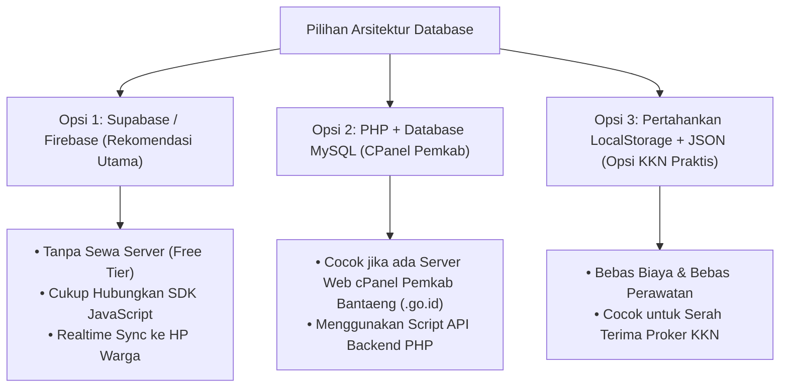

# Analisis & Rencana Pengembangan Sistem Database Website Kelurahan Mallilingi

## 1. Jawaban & Kondisi Sistem Saat Ini

> [!NOTE]
> **Status Sistem**: Website saat ini **belum menggunakan database server online** (seperti MySQL, PostgreSQL, atau Supabase).
> 
> Penyimpanan data yang berjalan saat ini menggunakan **Browser `LocalStorage` + Modul Cadangan Berkas JSON (JSON File Backup/Restore)**.

### Cara Kerja Penyimpanan Saat Ini (`js/data.js`):
1. **Master Data Default**: Berisi data awal profil, layanan surat, berita, katalog UMKM, dan aparatur kelurahan.
2. **`LocalStorage` Store**: Setiap kali admin melakukan perubahan di `admin.html` (tambah/edit/hapus berita, UMKM, layanan), perubahan langsung tersimpan permanen di memori browser lokal.
3. **Sistem Ekspor/Impor File JSON**: Admin dapat mengunduh seluruh data dalam bentuk berkas `.json` untuk cadangan (*backup*), atau memuat berkas `.json` tersebut ke perangkat lain.

---

## 2. Kelebihan & Keterbatasan Sistem Saat Ini

| Kategori | `LocalStorage` + Backup JSON (Saat Ini) | Database Online (Cloud/Server API) |
| :--- | :--- | :--- |
| **Biaya Hosting & Server** | **Rp 0 (Gratis Selamanya)** | Memerlukan Server Cloud / Web Hosting |
| **Keamanan Data** | **Sangat Aman** (Tersimpan lokal, tidak bisa diretas dari luar) | Perlu Proteksi API Key & Password Database |
| **Ketergantungan Internet** | **100% Offline Capable** (Bisa dibuka dari flashdisk) | Memerlukan Koneksi Internet Stabil |
| **Kemudahan Serah Terima KKN** | **Sangat Mudah** (Siap pakai tanpa konfigurasi server) | Memerlukan Pengelolaan Akun Database Cloud |
| **Sinkronisasi Antar Perangkat** | Manual (via Ekspor/Impor File `.json`) | **Otomatis Real-time** di seluruh HP & Komputer |

---

## 3. Opsi Rencana Pengembangan Sistem Database (Jika Diperlukan)

Apabila Anda ingin meningkatkan website ini agar data yang diinput dari HP/Laptop mana pun **otomatis tersinkronisasi secara online**, berikut adalah 3 opsi arsitektur database yang bisa kita terapkan:

### Opsi 1: Cloud Database Supabase / Firebase (Rekomendasi Terbaik)
- **Teknologi**: Supabase (PostgreSQL Cloud) atau Google Firebase Realtime Database.
- **Biaya**: **Rp 0 / Gratis (Free Tier untuk Kelurahan)**.
- **Keunggulan**:
  - Tanpa perlu sewa server backend atau PHP.
  - Cukup memasukkan API Key di `js/data.js`.
  - Ketika Lurah/Staf mengedit data di `admin.html`, seluruh warga yang membuka website di HP langsung melihat update berita/UMKM secara *real-time*.

### Opsi 2: PHP + Database MySQL (Jika Dipasang di Hosting Resmi `.go.id`)
- **Teknologi**: PHP 8 + Database MySQL / MariaDB.
- **Keunggulan**:
  - Sangat cocok jika nantinya website ini di-upload ke server hosting resmi Pemerintah Kabupaten Bantaeng (misal: `mallilingi.bantaengkab.go.id`).

### Opsi 3: Pertahankan Sistem `LocalStorage` + JSON (Rekomendasi Proker KKN)
- **Keunggulan**:
  - Tidak membebani pihak Kelurahan dengan biaya perawatan server atau risiko lupa *password* database cloud.
