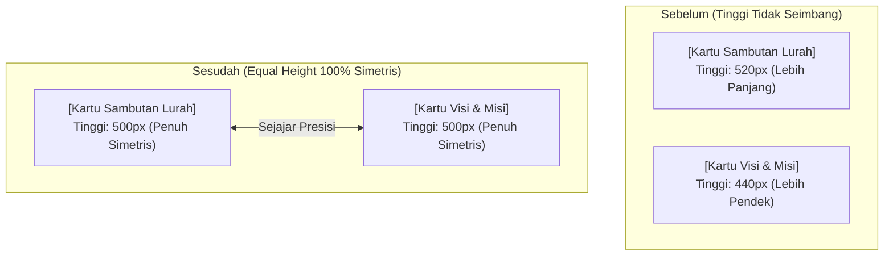

# Rencana Penyeimbangan Ukuran Kartu (Profil Lurah & Visi Misi)

## 📌 Deskripsi Perubahan
Pada tampilan Desktop saat ini, Kartu **Sambutan Lurah** (`.lurah-card`) dan Kartu **Visi Misi** (`.visi-misi-box`) memiliki tinggi yang tidak seimbang (kartu Lurah lebih tinggi dibanding kartu Visi Misi) karena sifat properti `align-items: center` pada Grid.

Rencana ini bertujuan untuk **menyetarakan tinggi kedua kartu secara presisi (Equal-Height Cards)** menggunakan teknik `align-items: stretch` dan Flexbox `height: 100%`, sehingga batas atas dan batas bawah kedua kartu berada pada satu garis lurus yang simetris dan elegan.

---

## 🎨 Perbandingan Sebelum & Sesudah



---

## 🛠️ Usulan Perubahan Kode (`css/styles.css`)

### 1. `css/styles.css`
#### [MODIFY] `css/styles.css`
```css
/* Sambutan & Visi Misi Section */
.profil-grid {
  display: grid;
  grid-template-columns: 1fr 1fr;
  gap: 2rem;
  align-items: stretch; /* Menyetarakan tinggi kedua kartu */
}

.lurah-card {
  background-color: var(--bg-white);
  border-radius: var(--radius-lg);
  padding: 1.75rem;
  box-shadow: var(--shadow-md);
  border: 1px solid var(--border-color);
  text-align: center;
  display: flex;
  flex-direction: column;
  justify-content: space-between;
}
```
