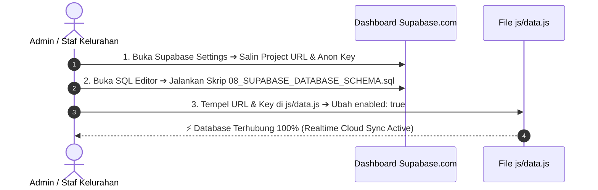

# Panduan Cara Mengkoneksikan Website ke Database Supabase Cloud ($0)

## 📌 Pendahuluan
Dokumen ini berisi panduan 3 langkah mudah untuk menghubungkan Platform Web Kelurahan Mallilingi ke Database Cloud **Supabase ($0 Selamanya)** agar data yang diinput dari `admin.html` tersimpan secara online dan tersinkronisasi di seluruh HP/PC warga secara *real-time*.

---

## 🛠️ 3 Langkah Mudah Mengkoneksikan Database



---

### 1️⃣ LANGKAH 1: Ambil URL & Anon Key dari Supabase
1. Login ke dashboard Supabase Anda di [https://supabase.com/dashboard](https://supabase.com/dashboard).
2. Pilih proyek database yang telah Anda buat.
3. Klik ikon **Project Settings** ⚙️ di pojok kiri bawah ➔ pilih tab **API**.
4. Salin 2 kunci berikut:
   - **Project URL** (contoh: `https://abcdefghijklm.supabase.co`)
   - **`anon` / `public` API Key** (kunci acak panjang diawali `eyJhbGci...`)

---

### 2️⃣ LANGKAH 2: Jalankan Skrip Tabel SQL (1-Click Setup)
1. Di dashboard Supabase, klik menu **SQL Editor** ⚡ di bilah kiri.
2. Buka berkas **[08_SUPABASE_DATABASE_SCHEMA.sql](file:///D:/KKN/Code/WebKelurahan/DOKUMENTASI/08_SUPABASE_DATABASE_SCHEMA.sql)** yang ada di folder proyek Anda.
3. *Copy* (Salin) seluruh kode SQL tersebut, lalu *Paste* (Tempel) ke dalam layar SQL Editor Supabase.
4. Klik tombol **Run** (atau tekan `Ctrl + Enter`).
5. Empat tabel utama (`info`, `layanan`, `berita`, `umkm`) akan otomatis tercipta secara instan.

---

### 3️⃣ LANGKAH 3: Tempelkan Kunci ke Berkas `js/data.js`
1. Buka berkas **[js/data.js](file:///D:/KKN/Code/WebKelurahan/js/data.js)** di text editor (VS Code / Notepad).
2. Cari bagian **`SUPABASE_CONFIG`** (sekitar baris 225):

```javascript
const SUPABASE_CONFIG = {
  // 1. Tempel URL Supabase Anda di bawah ini:
  url: "https://abcdefghijklm.supabase.co",
  
  // 2. Tempel Anon Key Supabase Anda di bawah ini:
  anonKey: "eyJhbGciOiJIUzI1NiIsInR5cCI6IkpXVCJ9...",
  
  // 3. Ubah false menjadi true untuk mengaktifkan koneksi!
  enabled: true 
};
```

3. Simpan berkas (`Ctrl + S`).

---

## 🎯 Cara Memastikan Database Sudah Terhubung:
1. Buka website `index.html` atau `admin.html` di browser Anda.
2. Tekan `F12` ➔ Buka tab **Console**.
3. Jika berhasil, Anda akan melihat pesan berwarna hijau:  
   `⚡ Supabase Cloud Database Terhubung!`
4. Setiap kali Anda menambah berita/UMKM di `admin.html`, data otomatis tersimpan di cloud database Supabase!
